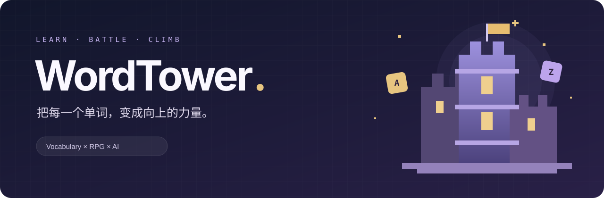

<p align="center">
  
</p>

<p align="center">
  <a href="https://github.com/JunieXD/WordTower/actions/workflows/deploy.yml"></a>
  <a href="LICENSE"></a>
  
  
  
</p>

<p align="center">
  <b>在故事里理解单词，在战斗中积累成长。</b><br />
  一个融合英语学习、像素风闯塔与 AI 出题的开源 Web 应用。
</p>

<p align="center">
  <a href="https://wt.juniexd.cn">在线体验</a> ·
  <a href="#玩法与功能">探索玩法</a> ·
  <a href="#本地启动">本地启动</a> ·
  <a href="docs/deployment.md">部署文档</a> ·
  <a href="CONTRIBUTING.md">参与贡献</a>
</p>

---

## 玩法与功能

选择适合自己的词库，阅读语境、组织句子、完成翻译。每一次作答都会推动战斗：击败敌人、向更高楼层前进，并积累用于角色成长的经验与金币。

| 学习方式 | 游戏体验 |
| --- | --- |
| **语境猜词** · 在短篇故事中理解词义 | **普通闯塔** · 答题战斗、逐层挑战、角色升级 |
| **完形填空** · 在句子中练习词汇搭配 | **每日挑战** · 共享题目路线，每天一次机会 |
| **关键词翻译** · 输出英文，获得 AI 批改反馈 | **好友与排行** · 查看好友动态、聊天、比较成绩 |
| **自选词库与作答历史** · 按目标学习，回看题目与答案 | **移动端与 PWA** · 适配手机，可添加到主屏幕 |

<p align="center">
  
  &nbsp;&nbsp;&nbsp;&nbsp;
  
</p>

### 好好答题，不必和网络较劲

网络抖动后的重试会复用同一次操作，避免重复出题或重复提交。短时请求密集时会显示温和的等待提示，并保留当前内容。后台预生成给当前作答留出容量；持续正常刷题没有每日题数上限。

实现细节与可调参数见 [请求频率与网络恢复](docs/traffic-protection.md)。

## 技术栈

| 层次 | 选型 |
| --- | --- |
| 前端 | Vue 3 · TypeScript · Vite · Pinia · Tailwind CSS · GSAP |
| 后端 | FastAPI · SQLModel · Alembic · Python 3.12+ |
| 数据与协调 | PostgreSQL · Redis |
| AI 出题与批改 | LangGraph · OpenAI 兼容 SDK · ECNU `ecnu-plus` |
| 交付 | Docker Compose · OpenResty · GHCR · GitHub Actions |

```text
frontend/       界面、战斗动画、状态管理与 PWA
backend/        API、出题流程、数据模型与测试
deploy/         反向代理、部署与备份脚本
docs/           运维、频率保护与第三方许可说明
```

## 本地启动

准备 Node.js **20.19+ 或 22.12+**、Python **3.12+**、[uv](https://docs.astral.sh/uv/)、PostgreSQL 和 Redis。应用需要可用的 ECNU API Key；实际模型调用会消耗该账号的额度。

### 1. 克隆与配置

```bash
git clone https://github.com/JunieXD/WordTower.git
cd WordTower
cp backend/.env.example backend/.env
```

编辑 `backend/.env`，设置 `DATABASE_URL`、`REDIS_URL`、`SECRET_KEY` 和 `ECNU_API_KEY`。先在 PostgreSQL 创建 `wordtower` 数据库。默认模型为 `ecnu-plus`，默认不启用 SRS。

### 2. 启动后端

```bash
cd backend
uv sync --frozen
uv run alembic -c app/alembic.ini upgrade head
uv run uvicorn app.main:app --reload
```

API 默认位于 `http://localhost:8000`，交互文档位于 `http://localhost:8000/docs`。

首次使用需要导入词典并建立词库，步骤见 [后端开发说明](backend/README.md#导入词库)。

### 3. 启动前端

在另一个终端中运行：

```bash
cd WordTower/frontend
npm ci
npm run dev
```

打开 Vite 输出的本地地址，注册账号、选择词库后开始挑战。

## 测试与部署

前端执行 `npm run type-check`、`npm run test:unit -- --run` 和 `npm run build-only`；后端执行：

```bash
cd backend
ECNU_API_KEY=test-key-not-used-by-unit-tests uv run --frozen python -m unittest discover -s app/test -p 'test_*.py'
```

单元测试不调用真实模型。Pull Request 自动运行检查；推送 `main` 后，GitHub Actions 构建带提交 SHA 标签的前后端镜像，并部署到生产环境。部署健康检查失败时尝试回退到之前的应用镜像。

生产 Compose 使用外部 PostgreSQL、Redis 与 `1panel-network`，不是一条命令启动所有依赖的本地开发环境。完整配置、ECNU 额度说明、备份与迁移步骤见 [部署与运维](docs/deployment.md)。

## 参与与许可

欢迎通过 [Issues](https://github.com/JunieXD/WordTower/issues) 反馈体验、报告问题，或提交 Pull Request。开始前请阅读 [贡献指南](CONTRIBUTING.md)。

WordTower 原创代码采用 [MIT License](LICENSE)。第三方代码、词典与美术素材保留各自许可，详见 [第三方说明](THIRD_PARTY_NOTICES.md)。感谢所有贡献者，以及 Vue、FastAPI、ECDICT 等开源项目。
