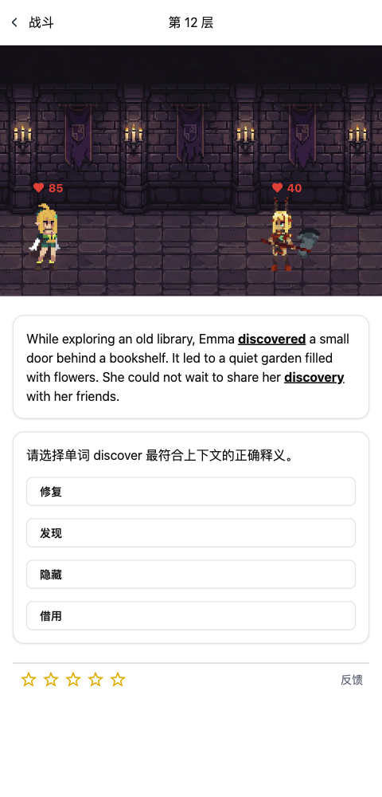
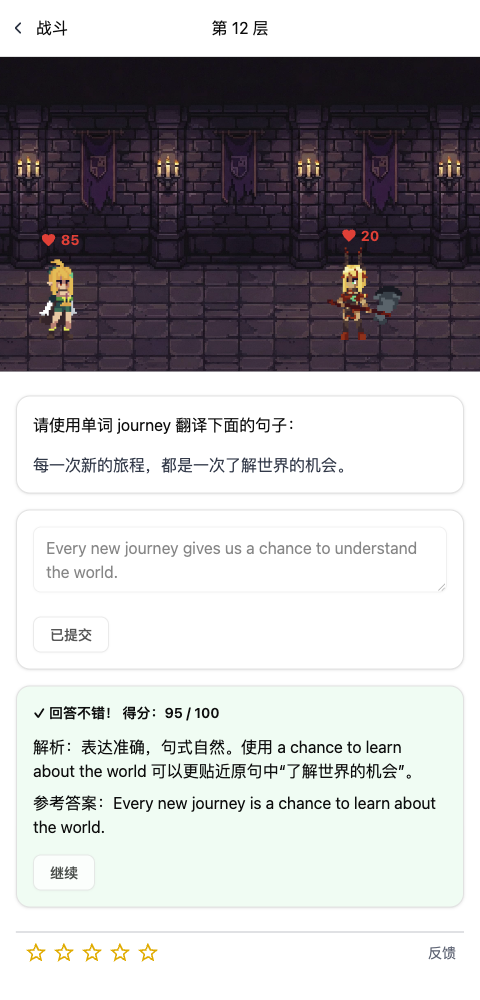
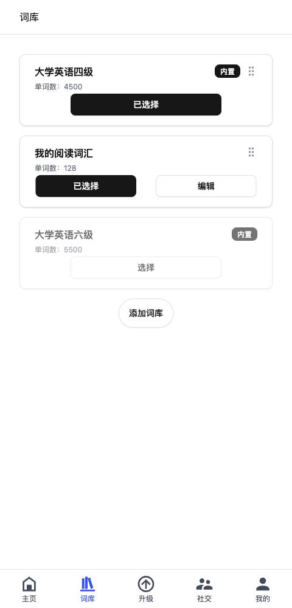
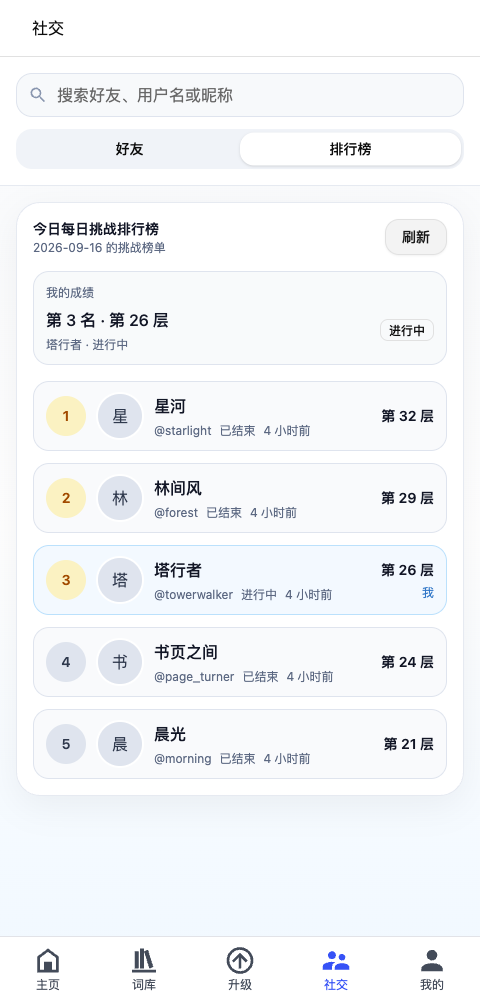

<p align="center">
  
</p>

<p align="center">
  <a href="https://github.com/JunieXD/WordTower/actions/workflows/deploy.yml"></a>
  <a href="LICENSE"></a>
  
  
  
</p>

<p align="center">
  <b>在故事里理解单词，在战斗中积累成长。</b><br />
  一个融合英语学习、像素风闯塔与 AI 出题的开源 Web 应用。
</p>

<p align="center">
  <a href="https://wt.juniexd.cn">在线体验</a> ·
  <a href="#功能亮点">功能亮点</a> ·
  <a href="#本地启动">本地启动</a> ·
  <a href="#界面预览">界面预览</a> ·
  <a href="CONTRIBUTING.md">参与贡献</a>
</p>

---

## 功能亮点

WordTower 将英语词汇练习融入像素风闯塔。选择词库，通过答题击败敌人、提升角色能力，在逐层挑战中积累词汇与表达经验。

- **在语境中理解词义**：结合短篇故事辨析单词，学习词汇在句子中的实际用法。
- **从理解到表达**：通过完形填空与关键词翻译练习句子组织，获得 AI 批改与表达建议。
- **让练习形成进阶目标**：挑战更高楼层，积累经验和金币，逐步提升角色能力。
- **按自己的目标学习**：选择内置词库或创建个人词库，回顾历史作答与题目解析。
- **与其他学习者共同挑战**：参与每日挑战、查看排行榜，与好友交流学习进展。
- **随时开始一轮练习**：适配桌面与移动端，支持添加到主屏幕。

## 界面预览

以下为实际应用界面，题目、用户及成绩均为模拟数据。

<table>
  <tr>
    <td width="50%" align="center"><b>语境猜词 · 答题闯塔</b></td>
    <td width="50%" align="center"><b>关键词翻译 · AI 反馈</b></td>
  </tr>
  <tr>
    <td></td>
    <td></td>
  </tr>
  <tr>
    <td align="center"><b>词库选择 · 个性化学习</b></td>
    <td align="center"><b>每日排行 · 持续挑战</b></td>
  </tr>
  <tr>
    <td></td>
    <td></td>
  </tr>
</table>

## 技术栈

| 层次 | 技术 |
| --- | --- |
| 前端 | Vue 3 · TypeScript · Vite · Pinia · Tailwind CSS · GSAP |
| 后端 | FastAPI · SQLModel · Alembic · Python |
| 数据存储 | PostgreSQL · Redis |
| AI 工作流 | LangGraph · 大模型 API |
| 构建与交付 | Docker Compose · GitHub Actions |

## 本地启动

准备 Node.js **20.19+（20.x）或 22.12+**、Python **3.12+**、[uv](https://docs.astral.sh/uv/)、PostgreSQL 和 Redis。

### 1. 获取代码与配置

```bash
git clone https://github.com/JunieXD/WordTower.git
cd WordTower
cp backend/.env.example backend/.env
```

创建 PostgreSQL 数据库，并按配置示例填写数据库连接、Redis 连接、登录签名密钥和模型服务访问参数。具体字段见 [`backend/.env.example`](backend/.env.example)。

### 2. 启动后端

在项目根目录执行：

```bash
cd backend
uv sync --frozen
uv run alembic -c app/alembic.ini upgrade head
uv run uvicorn app.main:app --reload
```

首次使用需[导入词典并建立词库](backend/README.md#导入词库)。后端默认地址为 `http://localhost:8000`，API 文档位于 `http://localhost:8000/docs`。

### 3. 启动前端

另开终端，在项目根目录执行：

```bash
cd frontend
npm ci
npm run dev
```

打开终端显示的本地地址，注册账号并选择词库，即可开始挑战。

## 开发与贡献

```text
frontend/       页面、战斗动画与客户端状态
backend/        API、出题流程与数据模型
deploy/         部署脚本
docs/           项目文档与展示资源
```

前端常用检查：`npm run type-check`、`npm run test:unit -- --run`、`npm run build-only`。测试说明与开发流程见[贡献指南](CONTRIBUTING.md)，服务端配置见[后端文档](backend/README.md)。

欢迎通过 [Issues](https://github.com/JunieXD/WordTower/issues) 提交问题或功能建议，也欢迎通过 Pull Request 参与开发。

## 许可

项目原创代码采用 [MIT License](LICENSE)。第三方代码与素材遵循各自许可，详见[第三方说明](THIRD_PARTY_NOTICES.md)。
